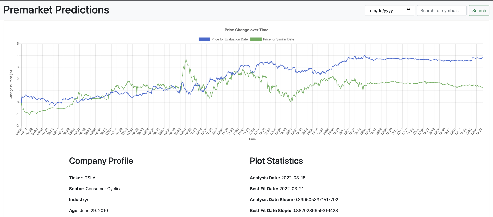
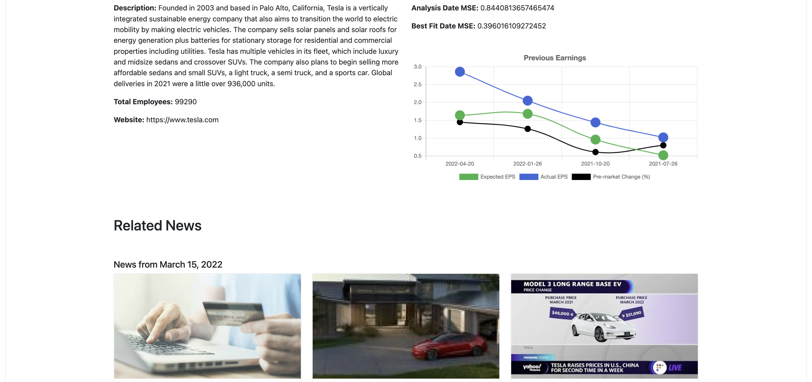
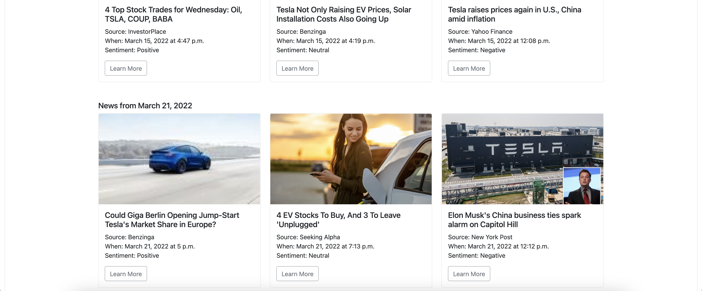

# Premarket Predictions
As most people know, the stock market opens at 9:30 am and closes at 4:00 pm. In addition to this, people have the opportunity, based on their brokerage, to trade during premarket hours (4:00 am to 9:30 am) or during after hours (4:00 pm to 8:00 pm). Everyone's goal with the stock market is to make a profit, whether it is through daily trading and making short term profits, or buying and holding onto stocks for long term profits. To try gaining an advantage, traders refer to popular finance-based websites such as finance.yahoo.com, nasdaq.com, and marketwatch.com to analyze companies and their stock information. While these websites focus on showing lots of information for stocks, they provide little to no analysis regarding premarket movement of a stock's price. Premarket information is can be very helpful in gauging the market outlook ahead of the regular open. As such, this UI has a focus on the premarket information to see if any trends can be found.

The layout of the UI is shown below:

## Dependencies
This project was implemented using Python via Django with data stored via MySQL. The front-end is HTML & CSS with Boostrap and Chart.js support.
The data to populate the database for this project was scraped from the following sources:
- https://www.alphaquery.com/
- https://api.polygon.io/ (api key needed)
- https://finance.yahoo.com/
- https://stocknewsapi.com/ (api key needed)

 To use this repository, you first need to install Python and MySQL. For python, you will need the following dependencies:
- sqlalchemy
- pymysql
- numpy
- pandas
- django
- requests
- beautifulsoup4
- requests_html
- pychart.js
- scikit-learn

Additionally, the database information is included in the sql dump file: `premarket_predictions_db.sql`.
This file includes data for the tickers AAPL, FB, and TSLA for all dates from 5/6/2021 to 5/6/2022. 

## Scraping Data
If the api keys and the database are propery configured, you can scrape data from several apis and websites and import the data into the database. First, make sure that `scrapedata.json` is properly configured (located in the base directory). The json file already has pre-defined values. 
- `"start_date": "2021-05-06"`: start of range of days to insert into database
- `"end_date": "2022-05-06"`: end of range of days to insert into database
- `"tickers" : ["AAPL"]`: list of tickers to insert into database
- `"add_dates": true`: adds dates to the dates table, only have this as true if it is the first time scraping data into the database
- `"stock_news_api_token": "o3b5ritrjxmkitqln5lbihcyufm11vkfnxwonb2r"`: api token for https://stocknewsapi.com/
- `"polygon_io_api_token": "2LAQUprTxW0lDVCXc05Ni8YFpJH2og3x"`: api token for https://api.polygon.io/
- `"hostname": "localhost"`: hostname for database
- `"port": "3306"`: port for database
- `"dbname": "premarket_predictions_db"`: database name
- `"user": "root"`: username for database
- `"pwd": "rootpassword"`: password for database

Once the json file is properly defined, you can run the scrape scripts via the `scrapescript.py` file in the base directory:
`python scrapescript.py`

## Using the UI
After scraping the data or importing via the sql dump file, the last step you need to do is run the UI. Currently this is only hosted locally, so from the base directory, you need to run the following:
`python3 manage.py runserver`

Once the server is running, you can type in a ticker that you imported and select a date to analyze (make sure the data is correctly in the databases). Have fun!

## Acknowledgements
This project is part of the Database Management Systems Course (CMSC 461) at UMBC.